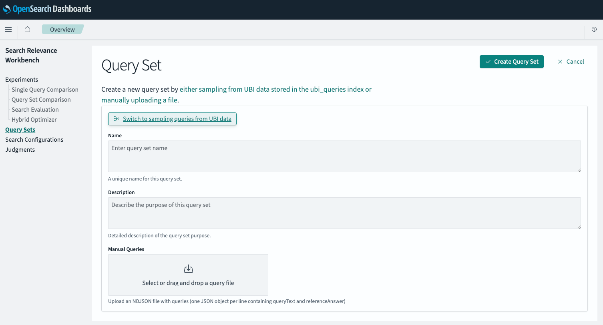

# Search Relevance Workbench Query Set Samples

The Search Relevance Workbench allows uploading manually generated [query sets](https://opensearch.org/docs/latest/search-plugins/search-relevance/query-sets/).

The two samples provided show how a query set with and without reference answers looks like.

## Query set without reference answer

```
{"queryText": "t towels kitchen"}
{"queryText": "table top bandsaw for metal"}
{"queryText": "tan strappy heels for women"}
{"queryText": "tank top plus size women"}
{"queryText": "tape and mudding tools"}

```

## Query set with reference answer

```
{"queryText": "What is the capital of France?", "referenceAnswer": "Paris"}
{"queryText": "Who wrote 'Romeo and Juliet'?", "referenceAnswer": "William Shakespeare"}
{"queryText": "What is the chemical symbol for water?", "referenceAnswer": "H2O"}
{"queryText": "What is the highest mountain in the world?", "referenceAnswer": "Mount Everest"}
{"queryText": "When was the first iPhone released?", "referenceAnswer": "June 29, 2007"}
```

## Uploading a query set manually

With the Search Relevance Workbench frontend and backend plugin enabled (see [the latest Search Relevance Workbench docs](https://opensearch.org/docs/latest/search-plugins/search-relevance/using-search-relevance-workbench/#enabling-search-relevance-workbench) on how to accomplish this) navigate to Search Relevance > Query Sets and click the Create Query Set button in the top right.
By default, this shows the input form to sample queries from UBI data. Selecting the "Switch to manually adding queries" button takes you to the manual upload page:



After defining a name and a description you can now either drag and drop your query sets in the appropriate format into the input form or click into the box and select the file to upload.
You will be presented with a preview once the file is parsed.

Confirm the upload by clicking the "Create Query Set" button.

You are now taken to the query set overview page and can select the created query set to inspect its details.
